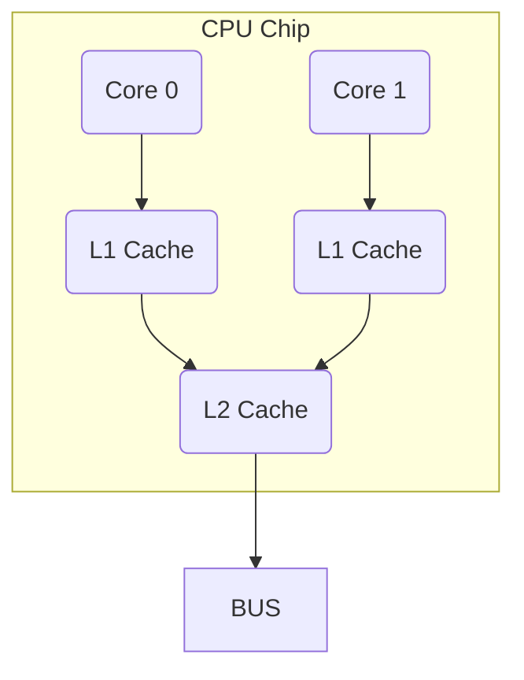

# Architecture

### Data Storage Sizes

|     Storage     |         Size         |
| :-------------: | :------------------: |
|      Byte       |   (8-bits, 1 byte)   |
|      Word       |  (16-bits, 2 bytes)  |
|   Double-word   |  (32-bits, 4 bytes)  |
|    Quadword     |  (64-bits, 8 bytes)  |
| Double quadword | (128-bits, 16 bytes) |

### C/C++ - Assembly mapped

|    C/C++     |   Storage   |
| :----------: | :---------: |
|     char     |    Byte     |
|    short     |    Word     |
|     int      | Double-word |
| unsigned int | Double-word |
|     long     |  Quadword   |
|  long long   |  Quadword   |
|    char*     |  Quadword   |
|     int*     |  Quadword   |
|    float     | Double-word |
|    double    |  Quadword   |

### General Purpose Registers (GPRs)

| 64-bit | 32-bit | 16-bit | 8-bit |
| :----: | :----: | :----: | :---: |
|  rax   |  eax   |   ax   |  al   |
|  rbx   |  ebx   |   bx   |  bl   |
|  rxc   |  ecx   |   cx   |  cl   |
|  rdx   |  edx   |   dx   |  dl   |
|  rsi   |  esi   |   si   |  sil  |
|  rdi   |  edi   |   di   |  dil  |
|  rbp   |  ebp   |   bp   |  bpl  |
|  rsp   |  esp   |   sp   |  spl  |
|   r8   |  r8d   |  r8w   |  r8b  |
|   r9   |  r9d   |  r9w   |  r9b  |
|  r10   |  r10d  |  r10w  | r10b  |
|  r11   |  r11d  |  r11w  | r11b  |
|  r12   |  r12d  |  r12w  | r12b  |
|  r13   |  r13d  |  r13w  | r13b  |
|  r14   |  r14d  |  r14w  | r14b  |
|  r15   |  r15d  |  r15w  | r15b  |

### Flag Register (rFlags)

**rFlags** is used for status and CPU control information. The **rFlag** register is updated by the CPU after each instruction and not directly accessible by programs. This register stores status information about the instruction that was just executed. Of the 64-bits in the **rFlag** register, many are reserved for future use.

|   Name    | Symbol | Bit  |                             Use                              |
| :-------: | :----: | :--: | :----------------------------------------------------------: |
|   Carry   |   CF   |  0   | Used to indicate if the previous operation resulted in a carry. |
|  Parity   |   PF   |  2   |  Used to indicate if the last byte has an even number 1's.   |
|  Adjust   |   AF   |  4   |       Used to support Binary Coded Decimal operations.       |
|   Zero    |   ZF   |  6   | Used to indicate if the previous operation resulted in a zero result. |
|   Sign    |   SF   |  7   | Used to indicate if the previous operation resulted in a zero result. |
| Direction |   DF   |  10  | Used to specify the direction ( increment or decrement ) for some string operations. |
| Overflow  |   OF   |  11  | Used to indicate if the previous operation resulted in an overflow. |

### Cache Memory

Cache memory is a small subset of the primary storage of RAM located in the CPU chip. If a memory location is accessed, a copy of the value is placed in the cache. Subsequent accesses to that memory location that occur in quick succession are retrieved from the cache location. A memory read involves sending the address via the bus to the memory controller, which will obtain the value at the requested memory location, and send it back through the bus. Comparatively, if a value is in cache, it would be much faster to access that value.

